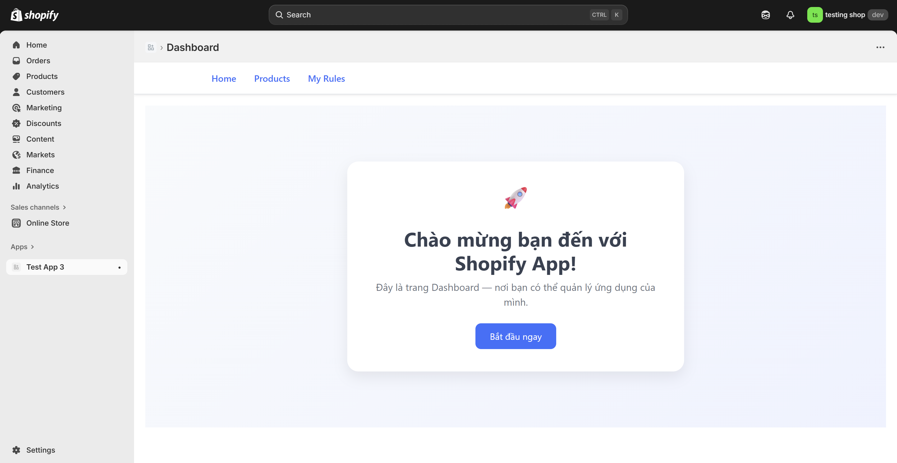
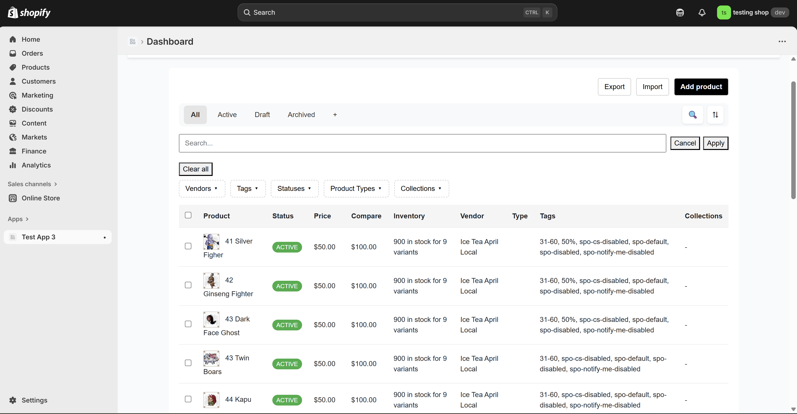
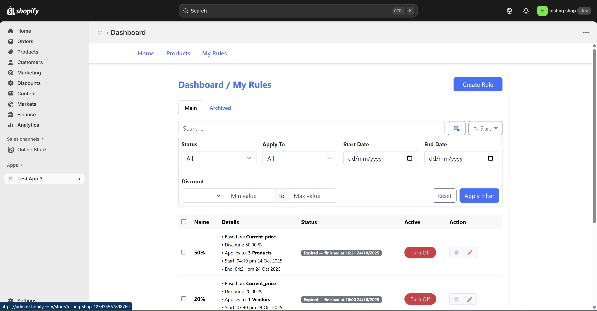
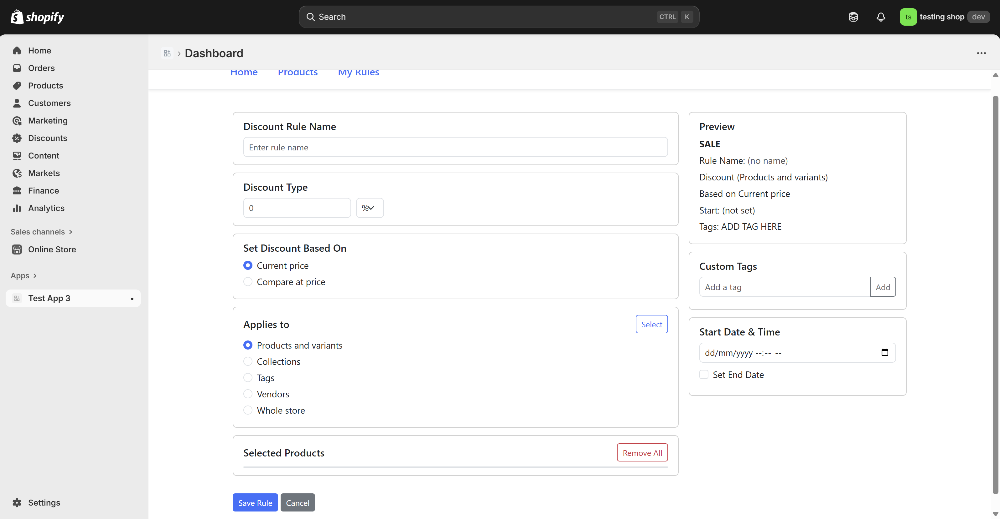

# 🚀 Hướng dẫn cài đặt và chạy dự án Laravel (Docker Version)

## 🧰 Yêu cầu hệ thống
Trước khi bắt đầu, hãy đảm bảo bạn đã cài đặt các công cụ sau:
- [Docker Desktop](https://www.docker.com/products/docker-desktop/)
- [Docker Compose](https://docs.docker.com/compose/install/)
- [Ngrok](https://ngrok.com/download)
- [Node.js và NPM](https://nodejs.org/en/download)

---

## ⚙️ Bước 1: Cài đặt dự án

Clone dự án về máy:

```bash
git clone <link-repo-của-bạn>
cd <tên-thư-mục-dự-án>
```

Cài đặt các package PHP (chạy trong container sau khi build xong):

```bash
docker-compose exec app composer install
```

Cài đặt các package JavaScript:

```bash
docker-compose exec app npm install
```

---

## 🧾 Bước 2: Cấu hình môi trường

Tạo file `.env` (nếu chưa có):

```bash
cp .env.example .env
```

Tạo khóa ứng dụng:

```bash
docker-compose exec app php artisan key:generate
```

Cập nhật thông tin database trong file `.env`:

```env
DB_CONNECTION=mysql
DB_HOST=db
DB_PORT=3306
DB_DATABASE=laravel
DB_USERNAME=root
DB_PASSWORD=root
```

Chạy migrate để tạo bảng:

```bash
docker-compose exec app php artisan migrate
```

---

## 🌐 Bước 3: Cài và chạy Ngrok

Nếu bạn chưa có Ngrok, tải và cài đặt tại:  
👉 [https://ngrok.com/download](https://ngrok.com/download)

Sau khi cài xong, chạy lệnh:

```bash
ngrok http 8080
```

Ngrok sẽ hiển thị một đường dẫn **Forwarding**, ví dụ:
```
Forwarding    https://example.ngrok.io -> http://localhost:8080
```

---

## 🔧 Bước 4: Cập nhật APP_URL

Mở file `.env` và thay dòng:

```env
APP_URL=http://localhost
```

bằng đường dẫn Ngrok vừa hiển thị, ví dụ:

```env
APP_URL=https://example.ngrok.io
```

---

## ▶️ Bước 5: Khởi chạy dự án

Khởi động toàn bộ ứng dụng bằng **Docker Compose**:

```bash
docker-compose up -d --build
```

> Lệnh này sẽ tự động tạo và chạy các container gồm:
> - **app**: chứa mã Laravel (PHP-FPM)  
> - **web**: máy chủ Nginx phục vụ Laravel  
> - **db**: cơ sở dữ liệu MySQL  

Sau khi các container đã chạy, ứng dụng sẽ hoạt động tại:  
👉 [http://localhost:8080](http://localhost:8080)

---

Nếu bạn có sử dụng **queue hoặc job**, hãy chạy thêm container worker:

```bash
docker-compose exec app php artisan queue:work
```

Chạy build frontend (nếu có):

```bash
docker-compose exec app npm run dev
```

---

## ✅ Kiểm tra hoạt động

Sau khi chạy thành công, truy cập **đường dẫn Ngrok** (ví dụ:  
👉 `https://example.ngrok.io`) để kiểm tra ứng dụng hoạt động đúng.  
> Lưu ý: Đường dẫn này phải trỏ đến **cổng 8080** (hoặc cổng bạn đã cấu hình trong docker-compose).

---

## 🧹 Một số lệnh hữu ích

Làm mới database:
```bash
docker-compose exec app php artisan migrate:fresh --seed
```

Xóa cache:
```bash
docker-compose exec app php artisan config:clear
docker-compose exec app php artisan cache:clear
docker-compose exec app php artisan route:clear
docker-compose exec app php artisan view:clear
```

Dừng toàn bộ container:
```bash
docker-compose down
```

---

## 📄 Ghi chú

- Đảm bảo **chạy Ngrok** trước khi truy cập ứng dụng để tránh lỗi `APP_URL` không đúng.  
- Khi thay đổi `APP_URL`, bạn **không cần rebuild container**, chỉ cần sửa `.env` và restart app:  
  ```bash
  docker-compose restart app
  ```
- Nếu dự án sử dụng **webhook** (Shopify, Zalo, v.v.), **Ngrok** là bắt buộc để nhận callback từ server bên ngoài.

---

## 🖼️ Một số hình ảnh giao diện

### Giao diện chính


### Giao diện Product


### Giao diện Rule


### Giao diện tạo Rule


---

## 💡 Tính năng Rule

Tính năng **Rule** cho phép bạn:
- Chọn sản phẩm và đặt giá giảm theo rule trong khoảng thời gian tùy chọn.  
- Khi hết thời gian, các sản phẩm sẽ **tự động quay về giá gốc**.  
- Hỗ trợ hoạt động nền qua **queue job** và có thể giám sát qua **supervisor** hoặc container worker.
